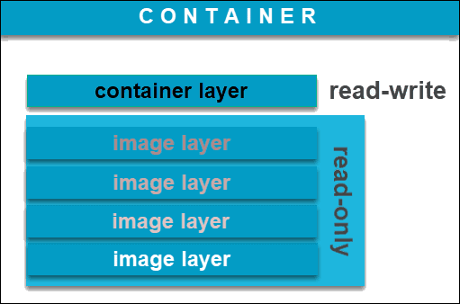

Image（镜像）和Container（容器）是Docker中两个重要的概念。

Image（镜像）：
- 镜像是一个只读的模板，包含了运行容器所需的文件系统、库、工具以及其他运行时需要的内容。
- 镜像可以看作是一个类比于面向对象编程中的类的概念，它定义了如何创建容器。
- 镜像通常是通过 Dockerfile 文件构建的，其中包含了构建镜像所需的指令。
- 镜像也经常从 registry 拉取（比如docker hub）。

Container（容器）：
- 容器是由镜像创建的运行实例，它包含了镜像以及在运行时所需的任何额外内容（例如文件、环境变量等）。
- 容器实质是复制 image 并在 image 最上层加上一层 read-write 的层 （称之为 container layer ,容器层），基于同一个 image 可以创建多个 container。
- 容器可以被启动、停止、删除、暂停等操作。
- 容器是一个独立的运行环境，可以在其中运行应用程序。

